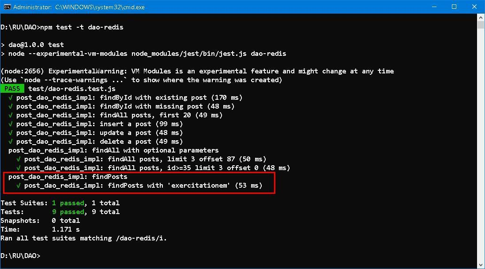

### DAO [兜](https://humanum.arts.cuhk.edu.hk/Lexis/lexi-can/) (cont.)


#### Prologue 
Some programmers are used to scrutinize things in minute level. Inconsistent nomenclature, abundance of variables, asymmetric layout and ineffective implementation are agonizing. Striking a balance between *what is need* and *what can do* is always a dilemma. Code, once written, has to be changed again and again, hardly comes to consummation. 
```
Reality is imperfect; 
perfection is unrealistic. 
No code is flawless.
```


#### I. DAO Server
To leverage `post_dao`, we are going to wrap it into a DAO server using [express](https://expressjs.com/). 

[`app.js`](https://github.com/Albert0i/DAO/blob/main/src/app.js)
```
import 'dotenv/config'
import express from 'express'

/* import routers */
import { router as postRouter } from './routers/posts-router.js'

const port = process.env.PORT || 3000;
/* create an express app and use JSON */
const app = new express()
app.use(express.json())

/* bring in some routers */
app.use('/api/v1/posts', postRouter)

// Start the server
app.listen(port, () => {
  console.log(`Running on http://localhost:${port}`);
  console.log(`Datastore is ${process.env.DAO_DATASTORE}`)
});
```

The following routes are provided by DAO server on `http://localhost:3000`: 
```
OPTIONS   /api/v1/posts
GET       /api/v1/posts
GET       /api/v1/posts/:id
POST      /api/v1/posts
PUT       /api/v1/posts/:id
DELETE    /api/v1/posts/:id
```

Where [`posts-router.js`](https://github.com/Albert0i/DAO/blob/main/src/routers/posts-router.js) is nothing but parameters passing and manipulation of http [status codes](https://developer.mozilla.org/en-US/docs/Web/HTTP/Status). 


#### II. Refining `findALL` in MySQL + ORM 
Modern RDBMS supports `OFFSET` and `LIMIT` in [SELECT](https://dev.mysql.com/doc/refman/8.4/en/select.html) Statement. The `OFFSET` clause allows one to return only those elements of a result set that come after a specified offset. The `LIMIT` clause is used to specify the number of records to return, which is useful on large table with thousands of records. Returning a large number of records can impact performance. 

We are going to amend `findAll` in `posts_dao.js`:  
```
/**
 * Get an array of all post objects.
 *
 * @param {number} [limit = 9999] - number of records to return. 
 * @param {number} [offset = 0] - numver of records to skip.
 * @param {number} [id = -1] - id number to start from, using '>='. 
 * @returns {Promise} - a Promise, resolving to an array of post objects.
 * @description Add optional parameters: limit, offset and id on 2024/08/19. 
 */
const findAll = async (limit = 9999, offset = 0, id = 0) => impl.findAll(limit, offset, id)
```

And implements in MySQL and Redis thereupon. By dint of capability of ORM, it takes only a couple of minutes to accomplish. 

Before: 
```
const findAll = async (limit = 9999, offset = 0, id = 0) => {
  return prisma.posts.findMany({ orderBy: { id: 'asc' } })
};
```

After: 
```
const findAll = async (limit = 9999, offset = 0, id = 0) => {
  //return prisma.posts.findMany({ orderBy: { id: 'asc' } })
  return prisma.posts.findMany({ 
        where: { id: {
                  gte: parseInt(id, 10)
               } }, 
        orderBy: { id: 'asc' }, 
        skip: parseInt(offset, 10), 
        take: parseInt(limit, 10)
  })
};
```

Prisma has comprehensive [CRUD](https://www.prisma.io/docs/orm/prisma-client/queries/crud) operations at your disposal. If you are dubious what happens under the hook. Use the `PrismaClient` [log](https://www.prisma.io/docs/orm/reference/prisma-client-reference#log) parameter to configure [log levels](https://www.prisma.io/docs/orm/reference/prisma-client-reference#log-levels), including warnings, errors, and information about the queries sent to the database.
```
const prisma = new PrismaClient({
  log: [{
    emit: 'event',
    level: 'query',
  }]
})

if (process.env.NODE_ENV === "development")
  {
    prisma.$on('query', (e) => {
      console.log('Query: ' + e.query)
      console.log('Params: ' + e.params)
      console.log('Duration: ' + e.duration + 'ms')
    })
  }
```

To get all posts: 
```
GET http://localhost:3000/api/v1/posts
```

SQL generated: 
```
Query: SELECT `movieDB`.`Posts`.`id`, `movieDB`.`Posts`.`userId`, `movieDB`.`Posts`.`title`, `movieDB`.`Posts`.`body` 
FROM `movieDB`.`Posts` 
WHERE `movieDB`.`Posts`.`id` >= ? 
ORDER BY `movieDB`.`Posts`.`id` ASC 
LIMIT ? OFFSET ?

Params: [0,9999,0]
Duration: 0ms
```

To get all posts with optional parameters: 
```
GET http://localhost:3000/api/v1/posts?limit=3&offset=1&id=98
```

SQL generated: 
```
Query: SELECT `movieDB`.`Posts`.`id`, `movieDB`.`Posts`.`userId`, `movieDB`.`Posts`.`title`, `movieDB`.`Posts`.`body` 
FROM `movieDB`.`Posts` 
WHERE `movieDB`.`Posts`.`id` >= ? 
ORDER BY `movieDB`.`Posts`.`id` ASC 
LIMIT ? OFFSET ?

Params: [98,3,1]
Duration: 0ms
```

Aha, not typically smart but it works... ORM is on your fingertips... 


#### III. Refining `findALL` in Redis
The pure JS code is for reference only. We focus on JS + Lua script approach. 

Before:
```
  // Method 2 - Lua script 
  // Script is loaded in redisClient.js 
  allPosts = retrofit(await findAllWithLua(postIDsKey)) 
``` 

After:
```
  // Method 2 - Lua script 
  // Script is loaded in redisClient.js 
  allPosts = retrofit(await findAllWithLua(postIDsKey, limit, offset, id)) 
```

The solution hinges on [`ZRANGE`](https://redis.io/docs/latest/commands/zrange/) on external index to determine retrieval range. This requires insight understanding on object model. We deliberately use the `id` as score in sorted set to facilitate subsequent access. [`ZRANGE`](https://redis.io/docs/latest/commands/zrange/) can perform different types of range queries: by index (rank), by the score, or by lexicographical order. 
```
    local key = KEYS[1]
    local limit = ARGV[1]
    local offset = ARGV[2]
    local id = ARGV[3]
    local ids 

    if id==0 then 
      -- Start from an offset
      ids = redis.call("ZRANGE", key, offset, offset + limit - 1)
    else
      -- Start from a specific id 
      ids = redis.call('ZRANGE', key, id, '+INF', 'BYSCORE', 'LIMIT', offset, limit)
    end

    local hash = {}
    local posts = {}

    for i = 1, #ids do
        hash = redis.call('HGETALL', ids[i])
        table.insert(posts, hash)
    end
    return posts
```


#### IV. [AUTO_INCREMENT](https://dev.mysql.com/doc/refman/8.4/en/example-auto-increment.html) in MySQL + ORM
> The AUTO_INCREMENT attribute can be used to generate a unique identity for new rows: 

> You can also explicitly assign 0 to the column to generate sequence numbers, unless the [NO_AUTO_VALUE_ON_ZERO](https://dev.mysql.com/doc/refman/8.4/en/sql-mode.html#sqlmode_no_auto_value_on_zero) SQL mode is enabled. For example:

> When you insert any other value into an AUTO_INCREMENT column, the column is set to that value and the sequence is reset so that the next automatically generated value follows sequentially from the largest column value. 

Let get started to modify post model: 

Before:
```
model Posts {
  id        Int     @id 
  userId    Int
  title     String
  body      String @db.Text
}
```

After:
```
model Posts {
  id        Int     @id @default(autoincrement())
  userId    Int
  title     String
  body      String @db.Text
}
```

A few keystrokes will suffice. Re-create post table with:
```
npx prisma db push 
```


Modify `seed-mysql.js` so as not to include `id` value. 
```
  for (let i = 0; i < postsData.length; i++) 
      await prisma.posts.create({ data: { 
                                          userId: postsData[i].userId, 
                                          title: postsData[i].title, 
                                          body: postsData[i].body 
                                        } })
```

Re-seed database with: 
```
npx prisma db seed
```

No need to change `insert` in `posts_dao_mysql_impl.js`. That's all! 


#### V. [AUTO_INCREMENT](https://dev.mysql.com/doc/refman/8.4/en/example-auto-increment.html) in Redis 
There is no such thing as auto increment in Redis. We are going to create our own in Lua script. 
```
    --
    -- Get an auto increment number of a key.
    -- 
    -- @param {string} KEYS[1] - The key to operate on. 
    -- 
    return redis.call("INCR", KEYS[1]..':auto_increment')
```

Modify `seed-redis.js` so as not to include `id` value. 
```
  for (let i = 0; i < postsData.length; i++) {
      const id = await autoIncrement(process.env.REDIS_PREFIX + ':posts')
      const postHashKey = getPostHashKey(id)
      const postIDsKey = getPostIDsKey()

      await redisClient.multi()
                      .hmset(postHashKey, { 
                                              id, 
                                              userId: postsData[i].userId, 
                                              title: postsData[i].title, 
                                              body: postsData[i].body 
                                          })   // 'OK' 
                      .zadd(postIDsKey, id, postHashKey)  // 1
                      .exec()
   }
```
 
Re-seed database with: 
```
npm run seed-redis
```

Change `insert` in `posts_dao_mysql_impl.js`. 
```
const insert = async (post) => {
  const key = process.env.REDIS_PREFIX + ':posts'
  const id = await autoIncrementWithLua(key)
  const postHashKey = getPostHashKey(id);
  const postIDsKey = getPostIDsKey()

  return redisClient.multi()
                    .hmset(postHashKey, post)           // 'OK' 
                    .zadd(postIDsKey, id, postHashKey)  // 1
                    .get(key + ':auto_increment')       // <new id>
                    .exec()
  // [ [ null, 'OK' ], [ null, 1 ], [ null, <new id> ] ]
};
```

Done! 


#### VI. Implementing `findPost` in MySQL + ORM
Instead of reading through page and page of posts, modern web site provides [Full-Text Search](https://dev.mysql.com/doc/refman/8.0/en/fulltext-search.html) facility to narrow down posts to be displayed. MySQL has support for full-text indexing and searching:

> Full-text searching is performed using [MATCH() AGAINST()](https://dev.mysql.com/doc/refman/8.0/en/fulltext-search.html#function_match) syntax. [MATCH()](https://dev.mysql.com/doc/refman/8.0/en/fulltext-search.html#function_match) takes a comma-separated list that names the columns to be searched. 

> [AGAINST](https://dev.mysql.com/doc/refman/8.0/en/fulltext-search.html#function_match) takes a string to search for, and an optional modifier that indicates what type of search to perform. The search string must be a string value that is constant during query evaluation. This rules out, for example, a table column because that can differ for each row.

> Prisma Client supports [full-text search](https://www.prisma.io/docs/orm/prisma-client/queries/full-text-search) for **PostgreSQL** databases in versions 2.30.0 and later, and **MySQL** databases in versions 3.8.0 and later. With full-text search enabled, you can add search functionality to your application by searching for text within a database column.

First, enabling full-text search in MySQL by updating post model: 
```
generator client {
  provider = "prisma-client-js"
  previewFeatures = ["fullTextSearch", "fullTextIndex"]
}

model Posts {
  id        Int     @id @default(autoincrement())
  userId    Int
  title     String
  body      String @db.Text

  // Enable full text search on these fields
  @@fulltext([title, body])
  @@fulltext([body, title])
}
```

Second, re-generate prisma client, re-create post table and re-seed posts data with: 
```
npx prisma generate
npx prisma db push 
npx prisma db seed
```


Third, modify `posts_dao.js` by augmenting `findPosts`.
```
/**
 * Get an array of all post objects, full-text search on title and body. 
 *
 * @param {string} keywords - key words to be search for. 
 * @returns {Promise} - a Promise, resolving to an array of post objects.
 * @description Add full-text on title and body, on 2024/08/22. 
 */
const findPosts = async (keywords) => impl.findPosts(keywords)
```

Last, implement `findPosts` in `posts_dao_mysql_impl.js` accordingly. 
```
const findPosts = async (keywords) => {
  // All posts that contain the keywords in title or body
  return prisma.posts.findMany({
    where: { 
            title: {
              search: keywords    
            }, 
            body: {
              search: keywords,
            },
          }
  })
}
```

Our test suite shows that it's working as expected: 
```
describe(`${testSuiteName}: findPosts`, () => {
  const keywords = 'exercitationem'
  test(`${testSuiteName}: findPosts with '${keywords}'`, async () => {
    const posts = await findPosts(keywords)
    expect(posts.length).toBe(9)

    for (let i = 0; i < posts.length; i++) {
      expect(posts[i].body.indexOf(keywords) !== 0 || 
             posts[i].body.indexOf(keywords) !== 0).toBe(true)
    }
  })
})
```


SQL Generated: 
```
Query: SELECT `movieDB`.`Posts`.`id`, `movieDB`.`Posts`.`userId`, `movieDB`.`Posts`.`title`, `movieDB`.`Posts`.`body` 
FROM `movieDB`.`Posts` 
WHERE MATCH (`movieDB`.`Posts`.`body`,`movieDB`.`Posts`.`title`)AGAINST (? IN BOOLEAN MODE)
Params: ["exercitationem"]
Duration: 1ms
```

With the help of ORM, we are subjected to less impact in treading on new feature provided by underlaying RDBMS. If you do not see usefulness so far, you should have your brain checked in hospital nearby, i suggest. 


#### VII. Implementing `findPost` in Redis
Redis is in-memory datastore featuring data structures such as string, list, set, sorted set, hash... etc. There's no point in implementing our own full-text search by reading hash by hash, checking value by value. Although it is completely possible but it's not efficient after all. 

> RediSearch is a [Redis module](https://redis.io/modules) that provides querying, secondary indexing, and full-text search for Redis. To use RediSearch, you first declare indexes on your Redis data. You can then use the RediSearch query language to query that data.

Currently, RediSearch only support hash and json data type and not all Redis installation necessarily has this module. 

First, enabling full-text search in Redis by creating an index with [FT.CREATE](https://redis.io/docs/latest/commands/ft.create/):
```
FT.CREATE DEMO:DAO:posts:index ON 
    HASH PREFIX 1 DEMO:DAO:posts: SCHEMA 
    id NUMERIC SORTABLE 
    userId NUMERIC SORTABLE 
    title TEXT SORTABLE 
    body TEXT SORTABLE 
```

Second, check with: 
```
FT.INFO DEMO:DAO:posts:index
```


There is no seed to re-seed the data. Continue to test with [FT.SEARCH](https://redis.io/docs/latest/commands/ft.search/): 

```
FT.SEARCH DEMO:DAO:posts:index exercitationem
```


If you are interested to know more, [RU203 · Querying, indexing, and full-text search](https://redis.io/university/courses/ru203/) is a good start. 

Last, implement `findPosts` in `posts_dao_redis_impl.js` accordingly.
```
const findPosts = async (keywords) => {
  // All posts that contain the keywords in title or body
  const result = await redisClient.call('FT.SEARCH', getPostIndexName(), keywords);
  const allPosts = retrofit(result.filter(item => (typeof item) === "object"));

  return allPosts
}
```

Our test suite shows that it's working as expected:
```
describe(`${testSuiteName}: findPosts`, () => {
  const keywords = 'exercitationem'
  test(`${testSuiteName}: findPosts with '${keywords}'`, async () => {
    const posts = await findPosts(keywords)    
    expect(posts.length).toBe(9)

    for (let i = 0; i < posts.length; i++) {
      expect(posts[i].body.indexOf(keywords) !== 0 || 
             posts[i].body.indexOf(keywords) !== 0).toBe(true)
    }
  })
})
```



All along the way in our Redis implementation, we have employed `string`, `hash` and `sorted set` and `RediSearch` module. Whereas there are `list`, `set`, `Geo`, `Pub/Sub`, `Stream` and other modules. Those data structures are simple to understand and yet can orchestrate complicated interactivity. 

`RediSearch` is specially designed to facilitate querying and aggregation. For the first time you saw `findPosts` has fewer lines of code in Redis than in MySQL + ORM. Check [here](https://redis.io/docs/latest/develop/reference/modules/), if you are interested in creating your own Redis module. 

IMHO, MySQL is business-oriented and Redis is noncommercial-oriented. That's it is awkward and clumsy to implement relational *things* such auto_increment. 


#### VIII. To wrap up 
Add new route to DAO server. 
```
router.get('/find/:keywords', async (req, res) => {
  const { keywords } = req.params
  const posts = await findPosts(keywords)
  
  res.status(200).send(posts)
})
```


And try 
```
http://localhost:3000/api/v1/posts/find/exercitationem
```
Add [Swagger](https://www.npmjs.com/package/swagger-ui-express) and browse to:
```
http://localhost:3000/api/v1/docs/
```


Yeah! 


#### Epilogue 
Documentation doesn't come for free, no documentation is surplus. We have done *threefold* in this issue. 

1. `jsdoc` is used to generate static function descriptions in `out/index.html` folder;
2. `jest` is used to write test suite as well as demonstrate how to invoke API in `test` folder;
3. `swaggerswagger-ui-express` is used to host Posts API so that you can play with on `http://localhost:3000/api/v1/docs/`. 


### EOF (2024/08/23)

