### DAO [兜](https://humanum.arts.cuhk.edu.hk/Lexis/lexi-can/)


#### Prologue 
Things, how trivial and minute they are. 

There is no tools fit for every problem, and there is no problem can not be solved. 


#### I. [Introducing Redis DAOs](https://youtu.be/NYbGKZXs33s)
In this unit, we'll start by learning what a DAO is, then we'll see how the example project uses domain objects and DAOs to implement a maintainable approach to data access.

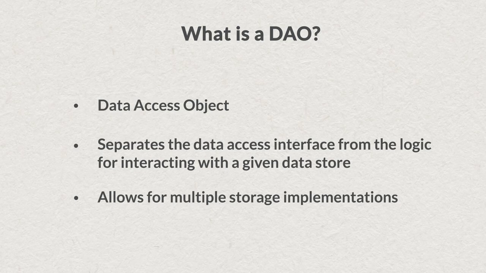

So what is a DAO anyway? DAO stands for *Data Access Object*. It's a design pattern that decouples data access from the interface used to access that data. In essence, we design an interface for accessing data. We then implement the interface for at least one data store. Perhaps it's Redis, or maybe it's Postgres. Either way, using this pattern allows for extensibility in the future. This idea is easier to understand with a diagram. The application we're building deals with solar power sites and the data they generate. 

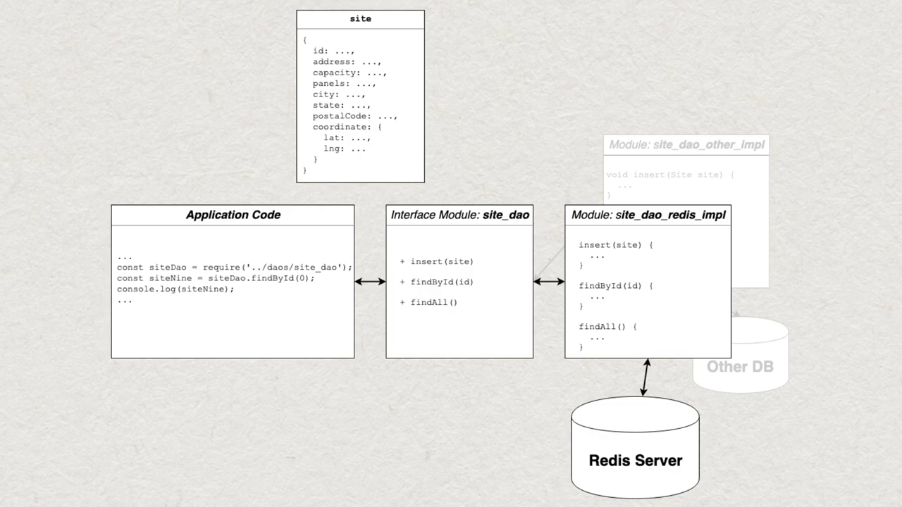

Here's an example domain object that represents a site. This plain old JavaScript object has a number of fields, including ID, address, and capacity measured in kilowatt hours. It also has an optional coordinate key, which, if present, contains the latitude and longitude representing the site's physical location. Once we've defined the properties of our domain object, we can create a DAO for it. The DAO itself is just an interface module that defines the data access functions we need. Here inside `site_dao.js`, there are exported functions for finding a site by ID and another for getting all sites.

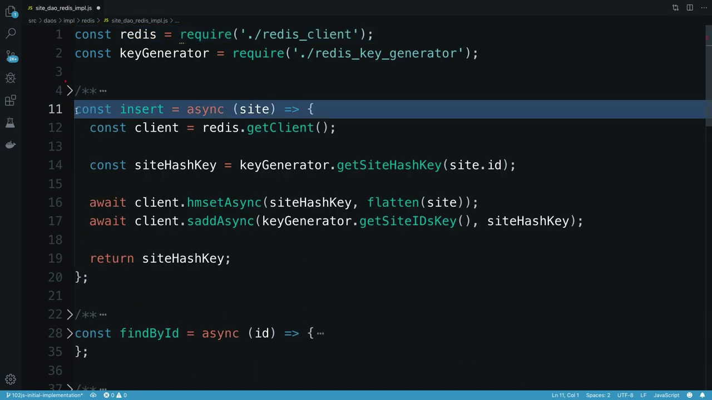

A third function handles inserting a new site. Each of these functions act as a passthrough to equivalents in modules that implement the DAO for a specific data store such as Redis. We now need to create a module that implements each of the functions exported by site_dao using Redis as the data store. So we do this in a module named `site_dao_redis_impl.js`. This DAO implementation will use `node_redis` to communicate with Redis and implement our data access functions. 


To recap, the DAO pattern enforces a separation of concerns in our codebase. It consists of three components, domain object, data access object interfaces, and data access object implementations. In our application, we're using plain old JavaScript objects as pure data representations of our domain. 

DAO interface modules define data store agnostic interfaces for persistence of domain objects. And DAO implementation modules implement a DAO interface for a particular data store such as Redis. In the next unit, we'll see how to leverage the DAO pattern to store site objects in Redis.


#### II. [Implementing a Redis DAO](https://youtu.be/PJqvha3iXZQ)
In this unit, we'll see how the DAO pattern is used in our application. Let's begin by looking at the project's folder structure. Here I'm viewing the `src/daos` folder. This contains one module per DAO. Each module describes the interface. The rest of the application's code only needs to know about these interfaces. And is not concerned with specific implementation details. 

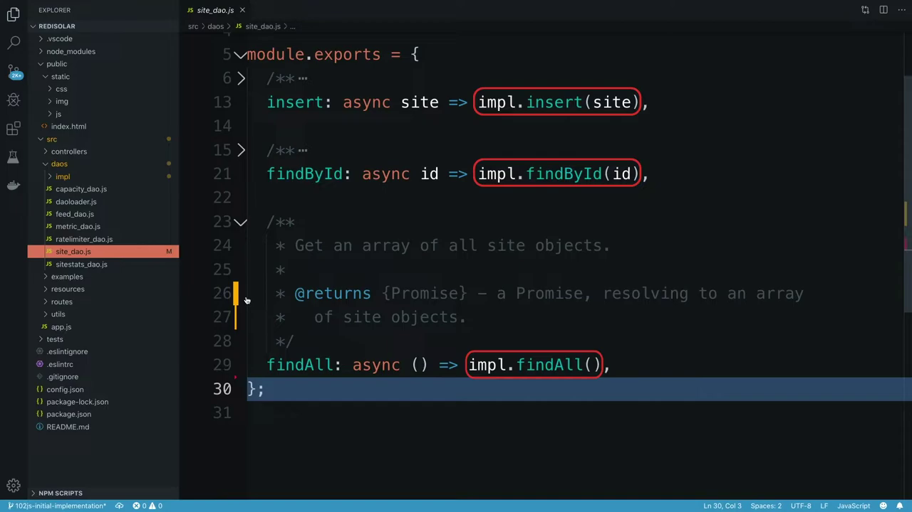

Let's take a look at `site_dao.js` to see how this works. At the bottom of the file, we can see which functions the DAO module exports. There are three data access functions for this DAO. First, there's `insert`, which takes an object containing a site. Next, is `findById`, which takes a site ID and returns a site object. And finally, there's `findAll`, which returns an array of site objects. All three data access functions are implemented using the same pattern. Each of them is an asynchronous function that simply calls another function of the same name on an object called impl. Here, impl represents a database-specific implementation of the DAO. 

When we require site DAO in our application code, an actual implementation of it will be loaded into impl for us by a helper module called the *DAO loader*. Calls to site DAO functions will then be handled by the implementing DAO. If you're interested in the machinery that makes this pattern possible, you should read the optional text, DAO Loader Implementation, that follows this video. 

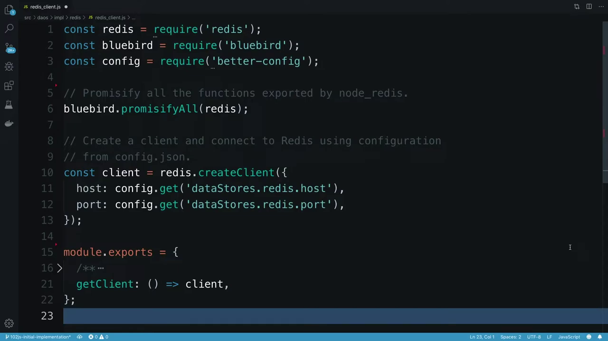

Inside the `daos/impl/redis` folder, you will find a module named `redis_client.js`. As we saw earlier in our introduction to `node_redis`, we only use a single client instance per application in most circumstances. Here we're creating a client instance using values from `config.json` and making it available to other modules through a single function, `getClient`. This function will be called from each of our Redis DAO implementations whenever they need to access the client and send commands to the database. 

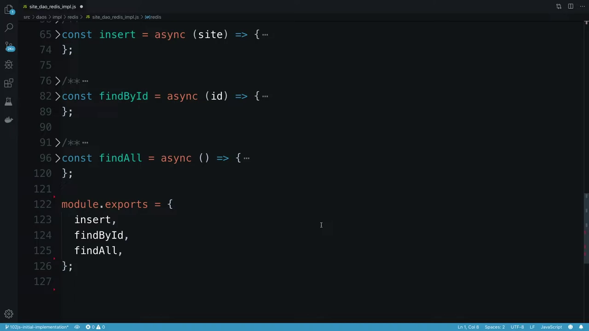

Let's now move on to see what a Redis implementation of site DAO looks like. Here I'm viewing `site_dao_redis_impl.js`. This module contains the Redis implementation of our site DAO. It exports functions whose names match those in `site_dao.js`. Namely, `insert`, `findbyId`, and `findAll`. 

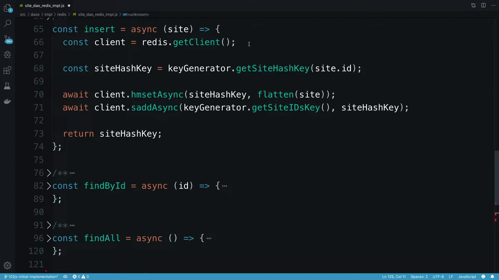

For now, we'll only look at the implementation of the `insert` function. We know from the definition that this method has to take a site object and write it to Redis. Let's see how. First, we call the `getClient` function to get the connected `node_redis` client instance. Next, we're going to write the site object's keys and values into a Redis hash. So first, we get the hash key. We then call `HMSET`, passing in our key as the first parameter, and the site object as the second. But we need a flat representation of the site object, since Redis hashes consist of a set of field value pairs. We can get this by calling the flatten helper function. Recall that our site objects look like this, with the coordinate information stored in a nested object. 

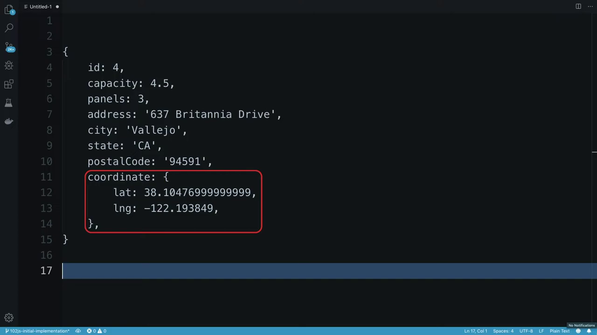

The helper function flatten in `site_dao_redis_impl`, removes this nesting for us. And here's what a flattened version of the site looks like.

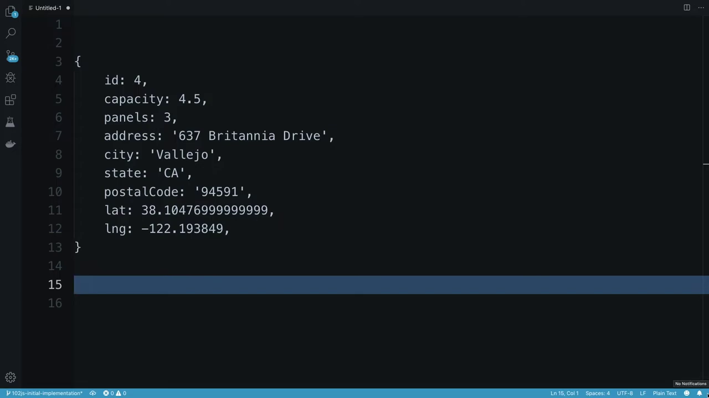

Having inserted our data into a hash, we then also add the key that points to the hash into a set containing all site hash keys. This is a simple matter of calling the `SADD` function, passing the key for the set, and the key for this specific site. That may be hard to follow, so here's a picture to help illustrate. 

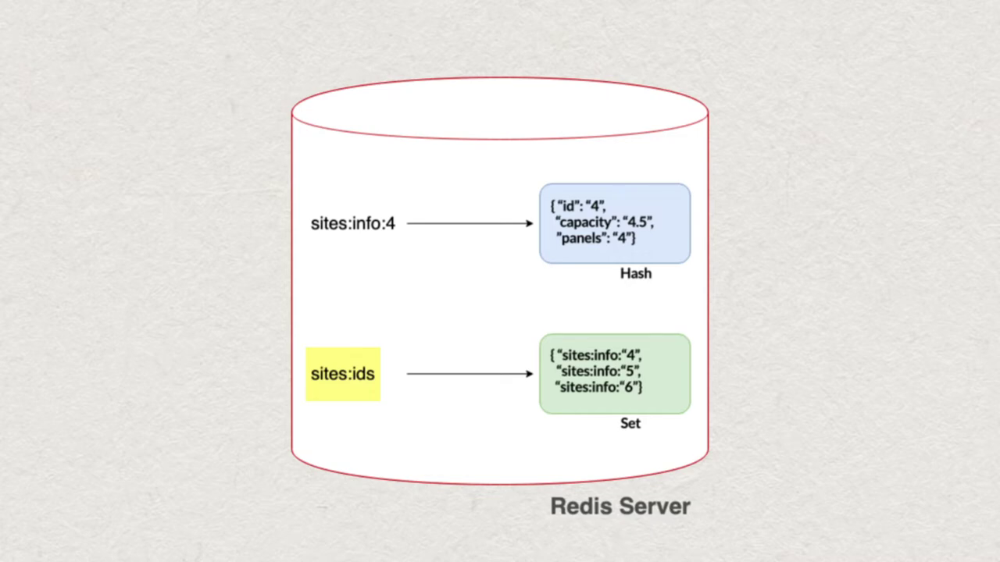

First we have a Redis hash containing our site data. The key pointing to that hash contains the site's ID, and its literal value is "sites:info:4". Next, we have a Redis set that stores these IDs. This set's key is "sites:ids". And it stores, among many other site IDs, the ID just mentioned. 

You may have noticed that I get the keys to these Redis data structures from something called `keyGenerator`. This module can be found in the `daos/impl/redis` folder. It exports functions to generate all of the Redis keys used by this application. Among these is `getSiteHashKey` and `getSiteIDsKey`. Having all of these key definitions in one place makes for a more maintainable codebase. If I ever have a question about which key names my application is generating, there's only one place in the code I need to look. Similarly, if I ever need to change the name of a key being generated, I simply open up the key generator module and find the relevant method. 

For this course, you should know that the key generator also adds a prefix to all keys. This serves as a namespace to avoid key name clashes with any other applications that might access the same Redis instance. By default, the prefix is "ru102js". So a call to `getSiteIDs` will return the key "ru102js:sites:ids". The prefix value is defined in `config.json`. The same Redis key will almost certainly be accessed in various methods in your DAO implementations. 

If you don't strictly control your key naming, you quickly have a mess on your hands. So in general, when it comes to naming Redis keys, always follow the *DRY principle*. That is, don't repeat yourself. OK, we made it to the end of this unit and covered a lot of material. We learned how DAOs and DAO implementations are organized in the RediSolar project. Having written an `insert` method, we now have a partially complete Redis site DAO implementation. We'll implement the remaining methods in the next unit and its accompanying programming challenge.


#### III. [Optional: DAO Loader Implementation](https://university.redis.com/courses/course-v1:redislabs+RU102JS+2024_03/courseware/b9e0436b7d504284bb29870a04d0147e/d12fff65d1dd4767b41f04565f4d2347/?child=first)
The `daoLoader` is a helper module (src/daos/impl/daoloader.js) that works with values in the project's `config.json` file.

config.json looks like this:
```
{
  "application": {
    "port": 8081,
    "logLevel": "debug",
    "dataStore": "redis"
  },
  "dataStores": {
    "redis": {
      "host": "localhost",
      "port": 6379,
      "keyPrefix": "ru102js"
    }
  }
}
```

The `dataStores` property is used by the `daoLoader` module to determine which path to load DAO implementations from. This allows us to potentially have multiple sets of DAO implementations for different databases and to switch between them through configuration with no code changes required.

The `loadDao` function loads a database specific implementation of each DAO based on this configuration value.
```
/**
 * Load an implementation of a specified DAO.
 * @param {string} daoName - the name of the DAO to load
 * @returns {Object} - the DAO implemenation for the currently configured database.
 */
const loadDao = (daoName) => {
  const currentDatabase = config.get('application.dataStore');
  return require(`./impl/${currentDatabase}/${daoName}_dao_${currentDatabase}_impl`);
};
```

For example, when loading the site DAO with dataStore set to redis, the daoloader will look for a site DAO implementation for Redis here:
```
daos/impl/redis/site_dao_redis_impl.js
```

The Redis DAO implementations live in the `src/daos/impl/redis` folder. This is also the only folder in the application's source tree that contains Redis specific code.

You won’t need to change the configuration or modify the `daoloader` when working with the sample project. You do however need to understand where the DAO implementations for Redis can be found, as these files are the focus of the programming challenges throughout this course.


#### IV. DAO Loader Rework
We are going to modify `daoloader.js` using [Javascript ES6](https://www.w3schools.com/js/js_es6.asp) `import` syntax and `dotenv` package, 

`daoloader.js`
```
import 'dotenv/config'

/**
 * Load an implementation of a specified DAO.
 * @param {string} daoName - the name of the DAO to load
 * @returns {Object} - the DAO implemenation for the currently configured database.
 */
const loadDao = (daoName) => {
  const currentDatabase = process.env.DAO_DATASTORE
  
  return import(`./impl/${currentDatabase}/${daoName}_dao_${currentDatabase}_impl.js`)  
};

export  { loadDao };
```

The `import` statement is considered more *modern* in JavaScript compared to the `require` function. A `DAO_DATASTORE` parameter is needed to indicate the datastore implementation to load.

`.env`
```
DAO_DATASTORE=redis

REDIS_PREFIX=DEMO:DAO
```


#### V. A Post DAO 
As you can see, DAO [design patterns](https://www.javier8a.com/itc/bd1/articulo.pdf) consists of *Domain Objects*, *DAO interface* and *DAO implementation*. 

- Domain objects: 
```
  {
    userId: 5,
    id: 44,
    title: "optio dolor molestias sit",
    body: "temporibus est consectetur dolore\net libero debitis vel velit laboriosam quia\nipsum quibusdam qui itaque fuga rem aut\nea et iure quam sed maxime ut distinctio quae"
  }
```

The improvised post object has `id`, `userId`, `title` and `body` field, two integers and two strings. Obviously, a more realistic post model should includes `createdAt`, `updatedAt`, `rating` and `followers` etc. Sample data are converted from [100 posts](https://jsonplaceholder.typicode.com/posts) of [{JSON} Placeholder](https://jsonplaceholder.typicode.com/). 


- DAO interface: 
```
import { loadDao } from "./daoloader.js"

const impl = await loadDao('posts');

/**
 * Insert a new post.
 *
 * @param {Object} post - a post object.
 * @returns {Promise} - a Promise, resolving to the string value
 *   for the ID of the post in the database.
 */
const insert = async post => impl.insert(post)

/**
 * Update a post.
 *
 * @param {Object} post - a post object.
 * @returns {Promise} - a Promise, resolving to the string value
 *   for the ID of the post in the database.
 */
const update = async post => impl.update(post)

/**
 * Delete a post.
 *
 * @param {Object} post - a post object.
 * @returns {Promise} - a Promise, resolving to the string value
 *   for the ID of the post in the database.
 */
const del = async post => impl.del(post)

/**
 * Get the post object for a given post ID.
 *
 * @param {number} id - a post ID.
 * @returns {Promise} - a Promise, resolving to a post object.
 */
const findById = async id => impl.findById(id)

/**
 * Get an array of all post objects.
 *
 * @returns {Promise} - a Promise, resolving to an array of post objects.
 */
const findAll = async () => impl.findAll()

/**
 * Disconnect database connection.
 *
 * @returns {void}
 */
const disconnect = async () => impl.disconnect()

export { insert, update, del, findById, findAll, disconnect };
```

As you can see, six functions are exported from `posts_dao.js`:

1. `insert`  : Insert a new post.
2. `update`  : Update a post.
3. `del`     : Delete a post.
4. `findById`: Get the post object for a given post ID.
5. `findAll` : Get an array of all post objects.
6. `disconnect` : Disconnect database connection.

Optionally, invokes `disconnect` will close connection manually. 


#### VI. Redis Implementation 
`posts_dao_redis_impl.js`
```
import { redisClient } from './redisClient.js'
import { findAllWithLua } from './scripts/findAll_script.js'
import { getPostHashKey, getPostIDsKey } from './redis_key_generator.js'

/**
 * Takes a key/value pairs object representing a Redis hash, and
 * returns a new object whose structure matches that of the post domain
 * object.  Also converts fields whose values are numbers back to
 * numbers as Redis stores all hash key values as strings.
 *
 * @param {Object} postHash - object containing hash values from Redis
 * @returns {Object} - object containing the values from Redis remapped
 *  to the shape of a post domain object.
 * @private
 */
const remap = (postHash) => {
  const remappedPostHash = { ...postHash };

  remappedPostHash.id = parseInt(postHash.id, 10);
  remappedPostHash.userId = parseInt(postHash.userId, 10);

  return remappedPostHash;
};

/**
 * Takes a array of array object representing a Redis hash, and
 * returns a new object whose structure matches that of the post domain
 * object.  Also converts fields whose values are numbers back to
 * numbers as Redis stores all hash key values as strings.
 *
 * @param {array} arr - array of array containing hash values from Redis
 * @returns {array} - array of object containing the values from Redis remapped
 *  to the shape of a post domain object.
 * @private
 */
function retrofit(arr) {
  let ret = []

  for (let i=0; i < arr.length; i++ ) {
      const element = arr[i]
      let obj = {}
      for (let j=0; j < element.length; j+=2 ) {
          const key = element[j]
          const value = element[j+1]
          if (key === 'id' || key === 'userId') 
              obj[key] = parseInt(value, 10)
          else
              obj[key] = value
      }
      ret.push(obj)
  }
  return ret
}

/**
 * Insert a new post.
 *
 * @param {Object} post - a post object.
 * @returns {Promise} - a Promise, resolving to the string value
 *   for the key of the post Redis.
 */
const insert = async (post) => {
  const id = post.id
  const postHashKey = getPostHashKey(id);
  const postIDsKey = getPostIDsKey()

  return redisClient.multi()
                    .hmset(postHashKey, post)           // 'OK' 
                    .zadd(postIDsKey, id, postHashKey)  // 1
                    .exec()
  // [ [ null, 'OK' ], [ null, 1 ] ]
};

/**
 * Update a post.
 *
 * @param {Object} post - a post object.
 * @returns {Promise} - a Promise, resolving to the string value
 *   for the key of the post Redis.
 */
const update = async (post) => {
  const id = post.id
  const postHashKey = getPostHashKey(id);
  
  return redisClient.hmset(postHashKey, post);  
  // OK
};

/**
 * Delete a post.
 *
 * @param {Object} post - a post object.
 * @returns {Promise} - a Promise, resolving to the string value
 *   for the key of the post Redis.
 */
const del = async (id) => {
  const postHashKey = getPostHashKey(id);
  const postIDsKey = getPostIDsKey()

  return redisClient.multi()
                    .del(postHashKey)               // 1
                    .zrem(postIDsKey, postHashKey)  // 1
                    .exec()
  // [ [ null, 1 ], [ null, 1 ] ]
};

/**
 * Get the post object for a given post ID.
 *
 * @param {number} id - a post ID.
 * @returns {Promise} - a Promise, resolving to a post object.
 */
const findById = async (id) => {
  const postKey = getPostHashKey(id);
  const postHash = await redisClient.hgetall(postKey);

  return (Object.keys(postHash) == 0 ? null : remap(postHash));
};

/**
 * Get an array of all post objects.
 *
 * @returns {Promise} - a Promise, resolving to an array of post objects.
 */
const findAll = async () => {    
  const postIDsKey = getPostIDsKey() 
  let allPosts = []; 

  // Method 1 - JS code 
  // const ids = await redisClient.zrange(postIDsKey, 0, -1)
  // let words = null; 
  // let id = null
  // let postHash = null; 
  
  // for (let i=0; i < ids.length; i++) {
  //   words = ids[i].split(':')
  //   id = words[words.length-1]

  //   postHash = await findById(id);
  //   allPosts.push(postHash)
  // }

  // Method 2 - Lua script 
  // Script is loaded in redisClient.js 
  allPosts = retrofit(await findAllWithLua(postIDsKey)) 

  return allPosts; 
};

/**
 * Disconnect from database.
 *
 * @returns {void}
 */
const disconnect = async () => {
  redisClient.disconnect()
}

export {
  insert, update, del, findById, findAll, disconnect
};
```

To test with: 
```
npm run seed-redis
npm test -t dao-redis
```

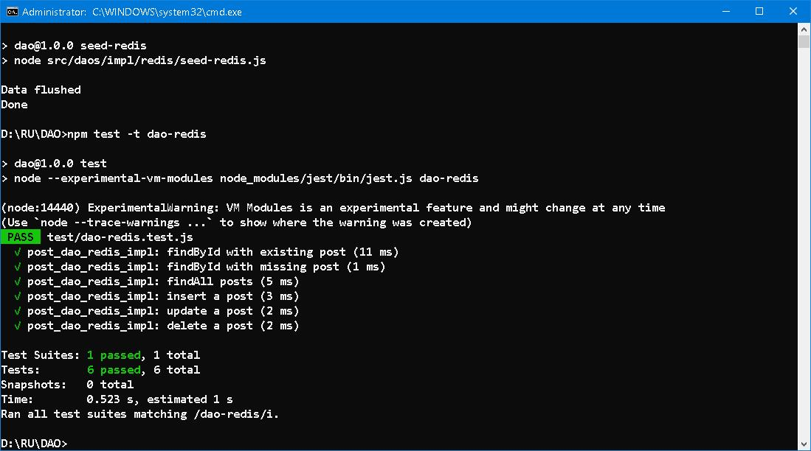


#### VII. MySQL Implementation 
`posts_dao_mysql_impl.js`
```
import { PrismaClient } from '@prisma/client'

const prisma = new PrismaClient()

/**
 * Insert a new post.
 *
 * @param {Object} post - a post object.
 * @returns {Promise} - a Promise, resolving to the string value
 *   for the key of the post Redis.
 */
const insert = async (post) => {
  return prisma.posts.create({ data: post })
}

/**
 * Update a post.
 *
 * @param {Object} post - a post object.
 * @returns {Promise} - a Promise, resolving to the string value
 *   for the key of the post Redis.
 */
const update = async (post) => {
  return prisma.posts.update({
    where: { id: post.id },
    data: post
  })
};

/**
 * Delete a post.
 *
 * @param {Object} post - a post object.
 * @returns {Promise} - a Promise, resolving to the string value
 *   for the key of the post Redis.
 */
const del = async (id) => {
  return prisma.posts.delete({
    where: { id  }
  })
};

/**
 * Get the post object for a given post ID.
 *
 * @param {number} id - a post ID.
 * @returns {Promise} - a Promise, resolving to a post object.
 */
const findById = async (id) => {
  return prisma.posts.findUnique({ where: { id } })
};

/**
 * Get an array of all post objects.
 *
 * @returns {Promise} - a Promise, resolving to an array of post objects.
 */
const findAll = async () => {    
  return prisma.posts.findMany({ orderBy: { id: 'asc' } })
};

/**
 * Disconnect from database.
 *
 * @returns {void}
 */
const disconnect = async () => {
  prisma.$disconnect()
}

export {
  insert, update, del, findById, findAll, disconnect
};
```

Change `DAO_DATASTORE` parameter to `mysql` in `.env`. And test with: 
```
npx prisma db seed
npm test -t dao-mysql
```

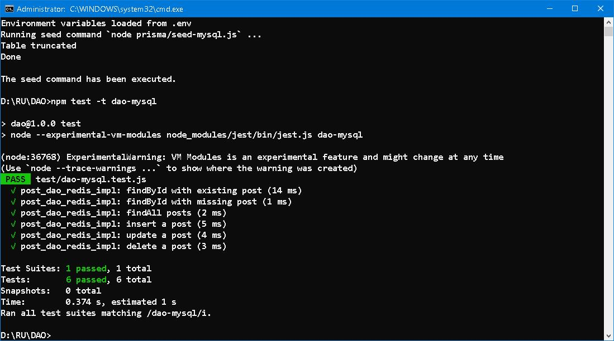


#### VIII. Retrospection 


#### IX. 


#### X. Bibliography 
1. [Redis for JavaScript developers](https://redis.io/university/courses/ru102js/)
2. [util](https://www.npmjs.com/package/util)
3. [JSDoc](https://jsdoc.app/)
4. [jest](https://www.npmjs.com/package/jest)
5. [THE BIG FOUR](https://www.gutenberg.org/files/70114/70114-h/70114-h.htm)


#### Epilogue 


### EOF (2024/08/16)
