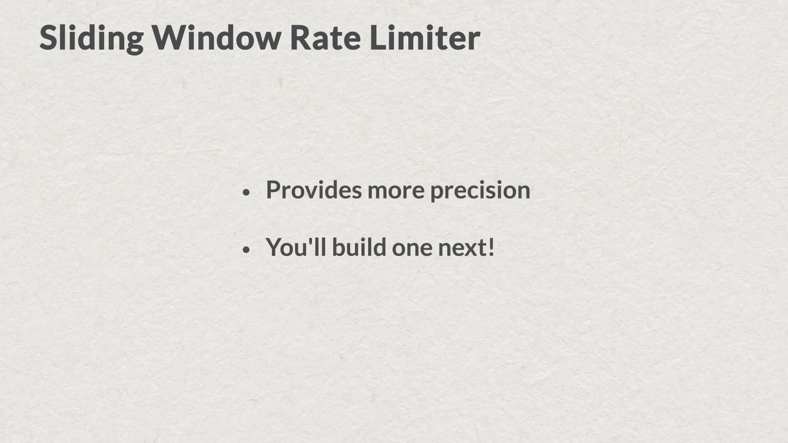

### Redis 二三事 

> Not often in a life-time does a man stand on the edge of eternity, but when I spoke those words in that East End cellar I was perfectly certain that they were my last words on earth. I braced myself for the shock of those black, rushing waters beneath, and experienced in advance the horror of that breath-choking fall.


#### Prologue 
Everybody is story-teller, i mean most of us. One relates stories of others, one relates stories of oneself. Chances are one gets a couple of audiences and more often than not the *only* audience is oneself. Just like one can have many nodding acquaintances but to aught one could confide... 

I am just an ordinary dull old man who cherish for anything valuable. Most of the material here is taken from [RU102JS- Redis for JavaScript developers](https://redis.io/university/courses/ru102js/) Week 4. 


#### I. [Redis Clients Overview](https://youtu.be/GwYozTVZrZQ)
We've seen how easy it is to get up and running with Node.js and Redis by studying a basic "Hello World" program. Before starting work on a larger project, let's first take a look at the role that a Redis client plays in an application's architecture. We'll then learn about the client implementations available to Node.js developers. Finally, I'll explain why we've chosen to use the node_redis client for this course. 


So to start, let's talk about what all Redis clients have in common. A Redis client library has to do three things. First, it needs to manage connections between the client and the server. Second, it has to implement the Redis wire protocol, and third, a Redis client needs to provide a usable, language-specific API. 

Let's look at each of these ideas in a bit more detail. The first job of a Redis client library is to manage the connections between your application and your Redis deployment. 


As you know, Redis is a database server. Clients must connect to Redis over a network and almost always use TCP sockets to do so. The Redis client library manages the lifecycle of these sockets, creating, configuring, and destroying them as appropriate. 

Clients may also have special code for pooling these connections for reuse. As both Node.js and Redis share a single-threaded programming model, pooling is not usually a concern for Node.js developers. 

The second job of a Redis client is to implement the Redis protocol. This protocol, formally known as `RESP` or the Redis Serialization Protocol, is the language that clients use to speak to the Redis server. We'll see some examples of how this protocol works in Chapter 4. 


If you're interested right now, there's a detailed specification of the protocol on the Redis.io website. You can see that [here](https://redis.io/docs/latest/develop/reference/protocol-spec/). 

Now, on top of the protocol, Redis clients must also implement the Redis API. This typically means that the clients expose all of the available Redis commands. When new commands are added to Redis, such as those added in Redis 5.0 to support Redis Streams, these commands need to be added to the Redis clients as well.

The final job of a Redis client is to provide a language-specific API to Redis. This usually boils down to conversions between Redis types and their language-specific counterparts. For instance, imagine a Redis hash. You probably know that a Redis hash is a set of key value pairs. So it's effectively an associative array, but how that's represented by a programming language is language-specific. In Java, a Redis hash translates most naturally into a map. In Python, it's a dictionary, and for JavaScript, it's an object. 


So for each of these languages, the Redis client deserializes a Redis type into a programming language-specific type. This makes Redis data easy to work with in most programming languages. 

So now we know what the role of a Redis client is. Let's look at the available clients for Node.js. on [redis.io](https://redis.io/clients#nodejs), you'll find a directory of clients organized by programming language. For Node.js, there's quite a few different options available. Those with a star by their names are recommended by the Redis community. The smiley face icons indicate clients that have had a release or update in the last six months. As we can see, two clients have both the star and smiley face icons.

They are **ioredis** and **node_redis**.  ioredis is a high performance full-feature client providing a clean and easy to learn API. Its strengths include a flexible system for mapping Redis responses to JavaScript types, including ES6 maps and sets and a useful abstraction for managing Lua scripts. It is well documented and actively maintained. 

The second recommended client is node_redis. It is also a highly performant client that supports all Redis functionality. We've chosen node_redis for this course, because it's the most commonly used. And chances are, if you have an existing Node.js codebase accessing Redis, then this is likely the client you're already using. 

In common with ioredis, node_redis provides an intuitive mapping between Redis commands and client API functions. This client is easily extensible. Should a new Redis version be released that includes additional commands, you can use these immediately without having to wait for a client update. We'll leverage this feature later in the course, when we introduce the new RedisTimeSeries module and start using commands that are only present when this module is loaded. 

For this course, we'll move forward with node_redis. However, don't forget that ioredis is also a community-recommended choice, and you should consider which of the two is the best match for your specific project needs.


For example, if you know you'll be managing lots of Lua scripts in your application, ioredis's script management functionality *may* make it the right choice for you. If you're using one of these clients, then later wish to migrate to the other, this should be a fairly straightforward task. Both clients have very similar philosophies and APIs and their differences are well-documented. Should your Redis journey include working with a Redis Enterprise cluster at some point, be assured that both recommended clients support this.

In this unit, we discussed the role of a Redis client and we've seen how to find recommended client implementations. We saw that there are two recommended clients for use with Node.js-- node_redis and ioredis. In this course, we'll be using node_redis, as it is the most commonly used client with Node.js.


#### II. [Building a Rate Limiter](https://youtu.be/let90x9uR_g)
In this unit, we're going to use Redis and Node.js to build a simple rate limiter. **A rate limiter keeps track of the number of requests a user is making and prevents careless users and malicious actors from making too many requests.** This is especially important when an API exposes *expensive* operations. If you're hosting an API that does image processing, for example, you want to make sure that users don't overwhelm your servers. A rate limiter can prevent this. 


There are many ways to build a rate limiter. Two common techniques are the fixed window and the sliding window.


A fixed window rate limiter counts all requests within a specific time interval. So as its name implies, you can stipulate that a user not make more than five requests in any one-minute fixed interval. Here each tick mark represents a request. So within the 12:01 interval, the user can make up to 5 requests. Within the 12:02 interval, the user can make another five requests. In both cases, the user will be rate limited on the sixth request within the fixed one-minute bucket. 


In a sliding window rate limiter, you can stipulate that a user not make more than five requests in any given 60-second interval, regardless of minute boundaries. So perhaps the user makes three requests at 12:00 and 30 seconds and three more requests at 12:01 and 15 seconds. In that case, the user will be rate limited, even though their six requests crossed the minute boundary.


A fixed window rate limiter is a bit easier to implement but less precise. A sliding window rate limiter is more precise but trickier to implement, uses a bit more space, and is slightly less time-efficient. 


In this unit, we'll see how to implement the fixed window rate limiter. And in the upcoming challenge, you'll build your own sliding window rate limiter. In `rate_limiter_dao.js`, we've defined the rate-limiting interface. 


It consists of a single function called `hit`, which takes two arguments: `name`, a string that uniquely identifies the thing being rate limited. You'll likely pass in a user ID or an API token here, indicating which user is hitting the service, and `opts`, an object containing two keys, which are `interval`, a minute interval, and `maxHits`, the number of hits allowed within the minute interval. The `hit` function returns a promise that resolves to the number of hits remaining or 0 if the user has exceeded the rate limit for the time interval. Now open up `rate_limiter_dao_redis_impl.js`. 


You can see here that our `hit` function is actually implemented in a function named `hitFixedWindow`. Turning to the implementation of the `hitFixedWindow` function, you'll see that we first get the name of the key storing the number of hits. This key naming is important, so let's take a moment to review it. 


The schema for a key looks like this. We have the text limiter followed by the name of the rate limiter, which will usually contain the user ID or access token I just mentioned. And that's followed by the minute block, which is the minute of the day or the block of minutes in the day that constitutes the fixed window. Finally, this is followed by the max number of hits for that interval. 

So here we create a pipeline. Then we atomically increment the value at the rate-limiting key by 1 using the `INCR` command. We set a time to live on the key with the `EXPIRE` command since we won't need the key once its interval is complete. We call exec on the pipeline to send the commands to Redis. Then we check to see if the number of hits is greater than the maximum allowed. If it is, we've reached the rate limit for this time period and return -1. If not, we return the number of hits remaining before the rate-limiting takes effect.


So we just saw how to build a fixed window rate limiter using Node.js and Redis. There are quite a few advantages to this approach. It's space-efficient, consisting of a counter stored in a single Redis key. It runs in constant time, employing two O(1) commands, INCR and EXPIRE. And it uses a pipeline, ensuring only one roundtrip to Redis. This design will work for a lot of use cases.


However, if you need more precision, you'll want a sliding window-based rate limiter. And in the next challenge, you'll get the chance to build one.




#### III. [Programming Challenge #7 Review](https://university.redis.com/courses/course-v1:redislabs+RU102JS+2024_03/courseware/6ec86ea00f894ac9bba46a829af4e28e/b5271ee833654fb6aab2601b92978662/)
This final challenge was to build a sliding window rate limiter in the `hitSlidingWindow` method of the `sliding_ratelimiter_dao_redis_impl.js` module.

Hints: for key naming, your key should take the form `[limiter]:[windowSize]:[name]:[maxHits]`. The key for the sliding window rate limiter doesn't need a minute block; instead you'll include the window size in the name to make it unique. Don't forget to use the `getKey` function in the key generator to ensure that your key is properly prefixed and will be cleaned up after the test suite finishes.

1. Add an entry to a sorted set with the current timestamp, in milliseconds, as its score. You can put whatever data you like for the member's value, but it should be unique. You could write something like `[timestamp]-[ip-address] or [timestamp-random-number]`.
2. Remove all entries from the sorted set that are older than `(CURRENT_TIMESTAMP - WINDOW_SIZE)`. Here, `CURRENT_TIMESTAMP` is measured in milliseconds, and `WINDOW_SIZE` is the number of milliseconds in your window. You can use the `ZREMRANGEBYSCORE` command to do this. This is how you'll slide the window forward in time. Running this command ensures that the only elements in the sorted set will be those that fall within the sliding window.
3. Now run the `ZCARD` command on the sorted set. This will return the number of elements in the set, which is now equal to the number of requests in the sliding window.
You should perform these three operations inside a transaction. You can then compare the return value of `ZCARD` with your `maxHits` value to determine whether to return -1 or the number of hits remaining within the window.

Here's a completed implementation to compare with your own.

```
// Challenge 7
const hitSlidingWindow = async (name, opts) => {
  const client = redis.getClient();

  // START Challenge #7
  const key = keyGenerator.getKey(`limiter:${opts.interval}:${name}:${opts.maxHits}`);
  const now = timeUtils.getCurrentTimestampMillis();

  const transaction = client.multi();

  const member = `${now}-${Math.random()}`;

  transaction.zadd(key, now, member);
  transaction.zremrangebyscore(key, 0, now - opts.interval);
  transaction.zcard(key);

  const response = await transaction.execAsync();

  const hits = parseInt(response[2], 10);

  let hitsRemaining;

  if (hits > opts.maxHits) {
    // Too many hits.
    hitsRemaining = -1;
  } else {
    // Return number of hits remaining.
    hitsRemaining = opts.maxHits - hits;
  }

  return hitsRemaining;

  // END Challenge #7
};
```

The code works as follows:

- First, we get the Redis client.
- The string `key` is then set to the key name to be used for the sliding window rate limiter. Remember to use `windowSizeMS`, `name` and `maxHits` in the key to ensure uniqueness. `limiter:60000:poirot:5 `, for example. 
- `keyGenerator.getKey()` is used to add the course's key namespace prefix.
- We then get the current time in milliseconds, storing it in `now`. The name of member does not matter provided that it's not duplicated. The score is the paramount here. 
```
const now = timeUtils.getCurrentTimestampMillis();
const member = `${now}-${Math.random()}`
```
The `${now}-${Math.random()}` is *smoke and mirrors* to captivate the audience while concealing the real purpose of the tricks; 

The value returned by `moment().valueOf()` is an integer representing the number of milliseconds elapsed since the Unix epoch (January 1, 1970, 00:00:00 UTC) up to the current moment. This value will be an integer, not a decimal number. It will typically be a large integer, as JavaScript uses milliseconds for timestamps. The `Math.random()` function is used to generate a random floating-point number between 0 (inclusive) and 1 (exclusive).

- Inside a transaction, we perform the following Redis commands:
1. Add a new member to the sorted set at key with ZADD. We set the score to the current time in milliseconds, and the value to `<current time in millisecnds>-<random number>` to ensure uniqueness of values. 
2. Remove members from the sorted set at `key` with `ZREMRANGEBYSCORE`. Members whose scores are less than the current time in milliseconds minus the length of the sliding window in milliseconds are removed. This ensures that the only members left in the sorted set are hits in the current sliding time window.
3. Get the cardinality of the sorted set at key with `ZCARD`.
4. If the cardinality of the sorted set is greater than the number of hits allowed in the sliding window, return -1 indicating that the rate limit has been reached. Otherwise, return the number of hits remaining in the sliding window.


#### IV. [Blocking Commands](https://youtu.be/3AZTTWE0FGQ)
Some Redis commands are known as *blocking* commands. These commands will block a client waiting for a result if one is not immediately available. While a node_redis client is blocked, it cannot send other commands to Redis. In this unit, we'll take a look at how to use blocking commands to implement a simple queue with node_redis. 


When might we choose to use a blocking command? Blocking commands are often used as a more efficient solution over polling the Redis server. What do we mean by polling? 

Suppose we have a Redis list and suppose we have two clients interacting with this list. One client is producing items onto the list, and a second client is consuming items from the same list, treating the list like a queue. Using standard list commands, the consuming client must periodically check the list for new values, perhaps giving up after a certain number of attempts. In other words, the consumer is never directly notified of new values in the list. Instead, it's constantly asking Redis whether there are any new values. This process is known as *polling*, and it's inefficient for a couple of reasons. 


First, the consuming client may make numerous unnecessary requests to the server, as the value it's looking for might not be there. Second, if it's important that the client get the value from the server as soon as it becomes available, then the client needs to make requests very frequently. If many consuming clients are polling the server, then the problem gets worse as the number of commands being sent increases with every new client added. 

Now let's consider a blocking approach instead. With blocking, the client will make a request to Redis for new values in the list as before. And if a new value exists, then it will be returned immediately. However, if no new value exists yet, then the consumer will be blocked on reading an element from the list. 


The moment the producer adds an element to the list, that element will be returned to the client and the client will unblock.


Let's see how this blocking approach works in practice. Here we are using the `BRPOP` command, which is the blocking version of `RPOP`. Just as a reminder, the `RPOP` command removes and returns the last element in the list. In this example, our application's Redis client will block and wait for a value to appear in the list named messages. The extra parameter is a timeout in seconds. So after 10 seconds, the client will be unblocked and return nil if no value is pushed onto the list in that time. Using a value of zero here will block the client indefinitely until a value appears. So now, our application's client is blocked and can't be used for other Redis commands. 


It is important to note, at this point, that this doesn't mean that the Redis server itself is blocked. Other clients can still send commands to it. 

Using the second client, I am now sending an LPUSH command to add an element, in this case, the string, "goodbye", to the list. This unblocks our consuming client, which returns the value "goodbye". We can also see the time in seconds that the client was blocked for. 


Using blocking commands prevents applications from needing to implement a polling strategy and saves the server from executing commands unnecessarily. The server informs the blocked client when the value it was waiting for has been set. The client can use the timeout option to give up after a period of time, if necessary, so that it doesn't wait forever. 

Blocking commands do add the slight overhead of managing more than one connection to Redis, in the case where your application needs to send other commands while its client is blocking. 


Let's see what that looks like with node_redis. Here I'm view the file `blocking_commands.js` in the examples folder. This uses the list data type and a blocking command to implement a simple queue. This is the producer function. It runs every second, pushing a number onto the head of a Redis list. I'm using the `LPUSH` command to do this, incrementing the value of the number pushed each time. 


After 20 iterations, the producer will stop pushing numbers onto the list and quit. 


At the other end of our queue is a blocking consumer function. This function uses its own separate node_redis client. We need this so that the producer can keep sending commands to Redis while the consumer blocks, waiting for values to appear in the queue. 


The consumer sits in a loop, sending the `BRPOP` command to retrieve the value from the tail of our list when one exists. It blocks for two seconds, then times out if no value has been added. The consumer function maintains a counter of the number of consecutive timeouts, exiting after 5 retries if no new value is added to the list. 


Here I'm starting the consumer, then starting the producer five seconds later. 


Let's see what happens when we run the code. The consumer starts first. No value is added to the list within it's 2-second timeout period, so it reports that the queue is empty and blocks again. This continues until the producer starts adding values to the list. The consumer's blocking `BRPOP` command then returns a value rather than timing out. 

Once the producer has generated 20 values, it shuts down. The consumer pops the 20th value off of the list and blocks again, waiting for a new value to appear. As the producer has shut down, no more values are added. The consumer's `BRPOP` command times out, and it reports that the queue is empty. After finding an empty list five consecutive times, the consumer also shuts down and closes its node_redis client. 


If you'd like to study this code in more detail yourself, it's available in a file named `blocking_commands.js` in the `examples` folder. 

Redis provides blocking commands for a variety of data structures. These include `lists`, of course, `sorted sets`, `streams`, and the `publish/subscribe` features. 


So in this unit, we saw how blocking commands work as a more efficient alternative to polling and how to implement a basic blocking queue with the list data type. 

Do keep in mind that within any Node.js application using node_redis, you'll need one client instance per blocking use case. This is the only time you'll need to initialize more than one client in a Node.js node_redis application.


#### V. [Error Handling](https://youtu.be/SdFIl5oSeVI)
Let's take a few moments to look at how node_redis handles errors. We'll first see how to deal with errors that occur when we send bad commands to Redis. Then we'll move on to look at how node_redis handles connection errors. 


We're looking at the file, `error_handling_async.await.js` in the `examples` folder. Here, I'm calling the `SET` command, but have not provided the second parameter containing the new value to store at key. In this case, we can expect the promised return from `setAsync` to be rejected, and caught by the catch handler, which will log the resulting error object.


Running the code shows that the promise is indeed rejected, and that node_redis returns a `ReplyError` object. 


Here we can see that the `ReplyError` object has a `name` property, as well as a `message` property whose value is the error message. Additionally, we can access the `command`, `code` and `args` properties separately. You can use these values in your error handling code to make decisions about what to do next, as well as to create informative log messages for your application. Errors resulting from sending invalid commands to the Redis server will all follow this same basic pattern. 


For example, here I am attempting to use the `INCR` command to increment the value of a key that contains a string. This is an invalid operation. So the promise returned by `incrAsync` will be rejected. We can expect to see that the catch block receives and logs an instance of `ReplyError`. And here's what that looks like. As before, we receive an appropriate error message, plus the breakdown of the command and the arguments that were sent to Redis.


So far, we've seen what to expect if an error occurs when sending a single command to Redis. Throughout the course, we've encouraged you to consider pipelining and transactions whenever multiple commands can be batched up together and sent to Redis in a single round trip. But what if one or more of those commands is invalid or otherwise fails? Let's take a look at that using a pipeline as an example. 


Here, I'm building up a pipeline containing three commands. I start by setting the value of a key to the string test. Next, I attempt to increment the value stored at that key. This will result in an error, as we cannot increment string values. Finally, I'll get the value stored in the key. I've wrapped the whole pipeline in a try/catch block. So when I call `execAsync` here to run the pipeline, we should expect to see the resulting promise to reject, with the error object logged by the catch handler. Let's run the code and see if that's what actually happens here. Here, I'm running the code to send the pipeline to Redis. 


And here's the result, which may not be what you were expecting. No exception was thrown, so our catch block was never executed. Instead, the promise returned by `execAsync` resolves successfully and returned an array of responses as normal. The first element in the array is OK, indicating that the initial `SET` command was successful. The second element is a `ReplyError` object. This tells us that the `INCR` command failed and why. 

It's important to note that this error did not cause the execution of further commands in the pipeline to stop. The third element in the array is the string test, which is the response for our `GET` command. You can also expect to see the same error reporting behavior when using a transaction. 

So when working with pipelines and transactions, you'll want to check the response array for errors and consider actions that your application might need to take if a command fails. Even if every command we send to Redis is correct, we'll still have to deal with another type of error. We need to handle the case where the Redis server is down or our application can't reach it over the network.


Let's see how node_redis handles connection errors, and how we can implement a connection retry strategy. The node_redis client emits events when the status of the connection to Redis changes. 


Here, I'm adding a listener for the connect event, which fires as soon as a connection to the Redis server is established. And here, I'm adding a listener for the reconnecting event. node_redis passes an object to this listener containing details about the number of retry attempts made so far, and the time since the last connection attempt. We'll see how this works shortly. 

Previously when creating a node_redis client, we saw that we can pass a configuration object to the `createClient` function. So far, we've used this to specify the host and port of the Redis server to connect to. This object can contain additional keys whose values are used to configure the client's behavior. 


One of these is retry_strategy, which can be set to a function containing logic for performing connection retries when Redis is down or otherwise unreachable. This function is invoked when the connection to Redis is lost or cannot be established.

It is passed an object containing details about the client's current retry attempt, and can use this information to decide how the client should proceed. Let's walk through a simple retry strategy implementation. Here, I'm checking if we have attempted to reconnect more than five times. If so, return an error, which stops node_redis from making further retry attempts. If we haven't retried five times yet, the function returns a number. This is the number of milliseconds that node_redis should wait before making the next retry attempt. 

Here, I'm using a basic decaying retry that waits one second, then two, and so on. The options object contains other keys whose values may be useful in building a retry strategy. For a full description of these, see the node_redis documentation. 

So bringing all of this together, we first create a Redis client, specifying our host, port, and retry_strategy. Then add event listeners for the connect and reconnecting events. Now let's see what happens when we run the code. 

First, I'm shutting down the Redis server on my Macintosh development machine. Now, I'm starting our example code. As the Redis Server is down, node_redis can't connect to it, and begins to run our retry strategy. On each retry, the reconnecting listener is invoked. And we can see that it receives an object containing information about the current retry attempt.


After five tries, the server is still down. So node_redis gives up and the program terminates. 


But what happens if we try and send commands to Redis while node_redis is attempting to reconnect to the server. 


Here, I've amended our example code to add a simple `SET` command and log the response in the Redis Server. If this command succeeds, we'd expect the string response, OK. Let's try running our code again with the Redis server offline. This time, though, I'll start Redis after a couple of connection retry attempts. OK, so Redis has stopped. Let's start our example code. We don't yet see an OK response from our `SET` command. But we can see attempts to reconnect to Redis. 

I'm now starting the Redis server, and the code's connected successfully. And our `SET` command has now also completed successfully. So what happened with our `SET` command here? 


It wasn't immediately sent to Redis because the connection wasn't available. node_redis buffered it for later execution, then sent it to Redis once the connection was established.


In this unit, we discovered how to handle errors that can arise from sending invalid commands to Redis. In a carefully written and well-tested, application these should be a rare occurrence. But it's always good to know how to deal with them. We also saw how node_redis can manage the connection to the Redis server should the server become unavailable or the connection lost. Being able to identify and report such occurrences is something that you should consider in your application design.


#### VI. [Performance Considerations](https://youtu.be/lekMouwJay0)
To say that performance is important is an understatement. After all, Redis was built for developers requiring sub-millisecond data access. Of course, performance is also a wide ranging topic, and in this unit we're going to stick to performance considerations for the application developer. 


These considerations can be divided into three main categories. The first concerns network latency, the second concerns the time complexity of Redis commands, and the last relates to atomicity and blocking. 


We've already discussed latency at length, but let's review the main points. First, you should use pipelining whenever you need to run more than one Redis command and don't need an immediate response to those commands. Pipelining cuts down on the number of round trips your client makes to the Redis server. It also results in less context switching on the server side and fewer syscalls. 


This is especially important when you're potentially making tens of calls to the Redis server. 

For example, in this `findAll` function, we first fetch a set of keys, and then for each key, we call `HGETALL`. This is the scenario you need to watch out for. In general, when running commands in a loop, you should strongly consider wrapping the loop in a pipeline like so. 


Let's now talk about the [time complexity](https://en.wikipedia.org/wiki/Time_complexity) of Redis commands. In general, it's important to be aware of the time complexity of the commands you're running. 


You can find the time complexity of every Redis command on the [Redis.io](https://redis.io/docs/latest/commands/) website. Constant time commands are the most efficient and, happily, quite a few Redis commands fall into the O(1) complexity bucket. These include `GET`, `SET`, `HGET`, `HSET`, `LPUSH`, `LPOP`, `SADD`, `SREM`, and many others. You generally don't have to worry about the performance of these commands. 


Logarithmic time commands are also very efficient and generally should not cause concern. You'll see these commands described as O(log(n)). We can see why these commands are efficient with a little math. Log base 2 of 10,000 is only about 13, and log base 2 of a million is only about 20. Many of the sorted set commands, such as `ZADD` and `ZRANK`, are O(log(n)). So running `ZADD` on a sorted set with a million elements has a time complexity of O(20). 


It's the linear time commands, the commands marked O(n), that you should be careful with. But even here, it all depends on the value of n. For example, let's look at the `LRANGE` example. You may recall this code from earlier in the course. Here, we're calling `LRANGE` to return all the elements of a list. If the list contains 50 elements, then this command has time complexity of O(50), and Redis can execute such a command in a matter of microseconds. But if the list contains a million elements, then we're at O(1,000,000), which is a completely different story. 


Running O(n) commands where n is large is a problem for two reasons. First, these commands can take a relatively long time to complete. This is because they use a lot of CPU and they tend to return a lot of data, which takes time to buffer. Second, because Redis is mostly single threaded, no other commands will be executed while these long-running commands are running. All other client commands will be queued up until the current command is done running. 

-commands.png)

So to take an example, on my development laptop running an LRANGE to retrieve all the elements in a four million element list takes the Redis server about 300 milliseconds or close to a third of a second. So if we have 1,000 clients all issuing commands against the Redis server and one client issues a command that takes 300 milliseconds for the server to process, then those 1,000 client commands will all queue up behind that long-running command, and they'll all have to wait for at least 300 milliseconds before each of them is served. 


There are a few O(n) commands that you should almost never run in production. The most notorious of these is the `KEYS` command, which returns all of the keys on the server matching a given pattern. As an example, running `KEYS *` on a key space of four million keys on my development laptop occupies the server for four seconds. And it's common for Redis servers to host hundreds of millions of keys. So we recommend never running the KEYS command on a production server. 

And if you build extremely large lists or hashes with thousands of elements, then you should probably also avoid `LRANGE` and `HGETALL` as well. It's a good practice to disable such commands altogether. See the links on this page for [documentation on disabling commands](https://redis.io/topics/security#disabling-of-specific-commands). 


OK, so to round out this chapter, let's review atomicity and blocking, specifically as they relate to transactions and Lua scripts. In Redis, transactions and Lua scripts both run atomically and block, which means that while they're running, no other commands can run. So you'll always need to keep this in mind when using these features. When running a transaction or Lua script, consider the time complexity of the commands you plan to run, and understand the cost of running thousands of commands within a transaction or Lua script. If you don't need transactional semantics, use a pipeline, which doesn't block for the duration of its run. 


Redis is a high-performance data store that keeps all of its data in memory. But you still have a responsibility to understand the cost of network round-trips, time complexity of the commands you're running, and the cardinality of your data structures. You'll get the most out of Redis by paying attention to these considerations as you design your data access strategies.


#### VII. [Debugging](https://university.redis.com/courses/course-v1:redislabs+RU102JS+2024_03/courseware/26a1adfb13d8404cb4cecd0079bfb2a6/5a5948815f1d411bab34b6021b7c8291/?child=first)
**Debugging**

From time to time, your Redis application may not behave in the expected way. That's when you'll need to start debugging. How do you debug a Redis application written with node_redis?

**1. Check for Expired Keys**

Key expiry is an important feature of Redis. However, you can't have code that depends on keys that have already expired. So, when debugging an issue, be certain that the keys your code depends on still exist.

Check to see which keys you're calling [EXPIRE](https://redis.io/commands/expire) on, and be sure that the TTLs are adequate.

Check your Redis memory settings. If the [maxmemory-policy](https://redis.io/topics/lru-cache#eviction-policies) setting is set to anything other than noeviction, then Redis will start evicting keys once it hits max memory.

**2. Try it in the CLI**

The Redis CLI is perfect for testing your data access patterns. If your code isn't working as expected, try running the equivalent Redis operations using the CLI. If it doesn't work in the CLI, it's not going to work in your application, either.

**3. Monitor the Commands Sent to Redis**

If it works in the CLI but not in your application, then it's possible that the application, somehow, isn't sending the right commands or arguments to the Redis server. For that, Redis provides a command that emits a stream of all operations being sent to the server. The command is called [MONITOR](https://redis.io/commands/monitor). You'll see how to use it in the upcoming hands-on activity.

**4. Special Case: Lua**

Lua scripts can be tricky to debug. Redis includes a proper, [fully-featured debugger](https://redis.io/topics/ldb) for Lua that you can read about on the redis.io documentation site.


#### VIII. [Client Protocol](https://university.redis.com/courses/course-v1:redislabs+RU102JS+2024_03/courseware/26a1adfb13d8404cb4cecd0079bfb2a6/5a5948815f1d411bab34b6021b7c8291/?child=first)
**The Redis Protocol**
The Redis protocol was designed with simplicity in mind. For this reason, it's text-based and human-readable. You can read all about the protocol on the redis.io documentation page.

Here's a small example. If you run the command:
```
lpush test hello
```

It will be encoded as follows (Note that the protocol is delimited by newlines, which consist of a carriage return (\r) followed by a line feed (\n):
```
*3\r\n
$5\r\n
lpush\r\n
$4\r\n
test\r\n
$5\r\n
Hello\r\n
```

Recall that the command consists of three strings: "lpush", "test" and "hello".

So the first line "\*3" indicates that we're sending Redis an array of three elements. The "\*" indicates the array type, and the "3" indicates length. The three strings will follow.

The first element of the command we're running is a 5-character string. So we pass in a "$" to signify the string type and follow that with a 5 to indicate the size of the string. The next line is the string itself, delimited by a newline: "**lpush**\r\n".

The next two strings follow the same pattern: "$" to indicate a string, then a length, then a CRLF.

This command has an integer reply of 1. In the Redis protocol, that reply looks like this:
```
:1\r\n
```

Here, the ":" character indicates that the reply is an integer. This is followed by an integer. The line is then terminated with a CRLF.

**Viewing the Redis Protocol Live**
If you're on a Linux machine, you can observe the Redis protocol in action using [ngrep](https://en.wikipedia.org/wiki/Ngrep):

```
ngrep -W byline -d lo0 -t '' 'port 6379'
```

If you can't use ngrep, [Wireshark](https://www.wireshark.org/) also works.


#### Epilogue 
A note on [Wireshark](https://www.wireshark.org/)

Download, install and open Wireshark. Click the `button` on the right to show/hide interfaces if it's not listed in the main page. 


Choose `Edit` → `Preferences` → `Protocols`. Scroll down to `RESP`. Edit the port number if necessary. As you can see, I am running Redis on port 7000. Press `OK` to exit. 


Input port 7000. choose loopback interface and press big `Start` on the top left corner. 


Open `redis-cli` and run `lpush test hello` command. Four entries are shown accordingly. 


Double click on entry with `lpush test hello` in `info` column. Scroll down to check the content sent. 


Press `Close` and double click on the next entry and check the content receive3d. 


The very first entry is `info` command, Redis has sent it to make sure connection is available. 


### EOF (2024/08/30)