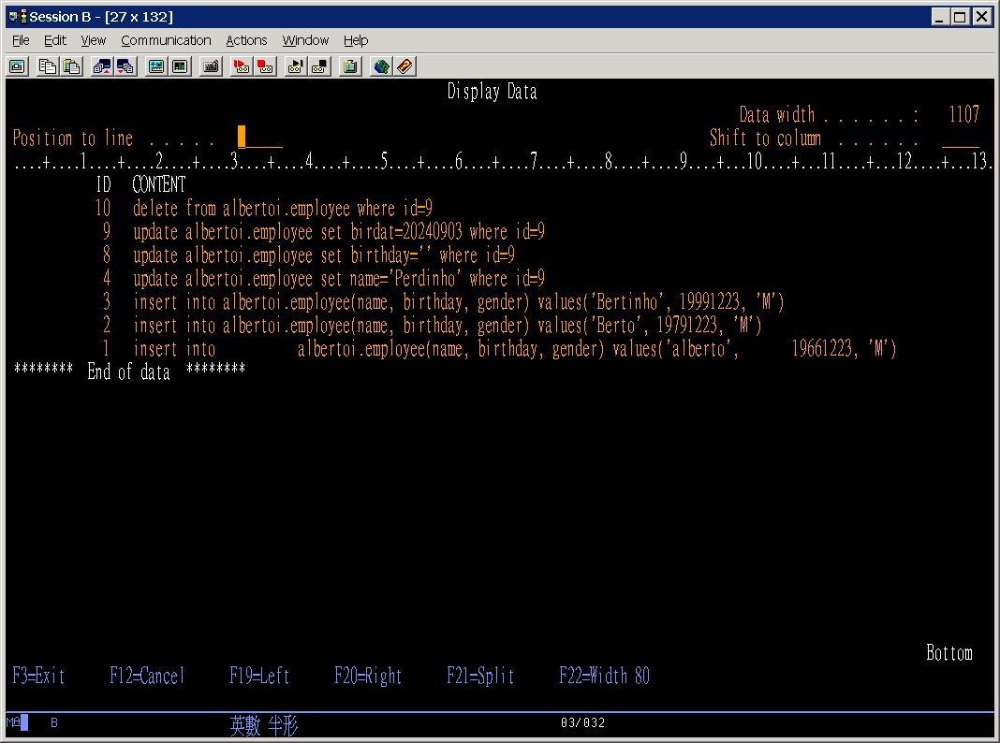
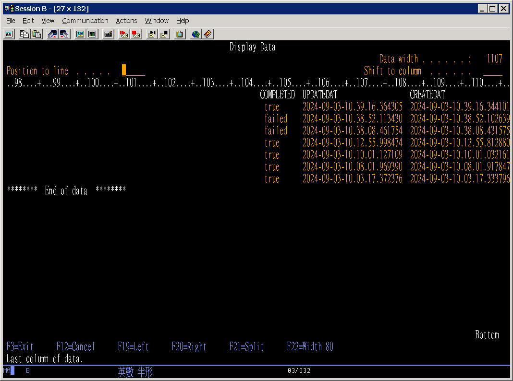
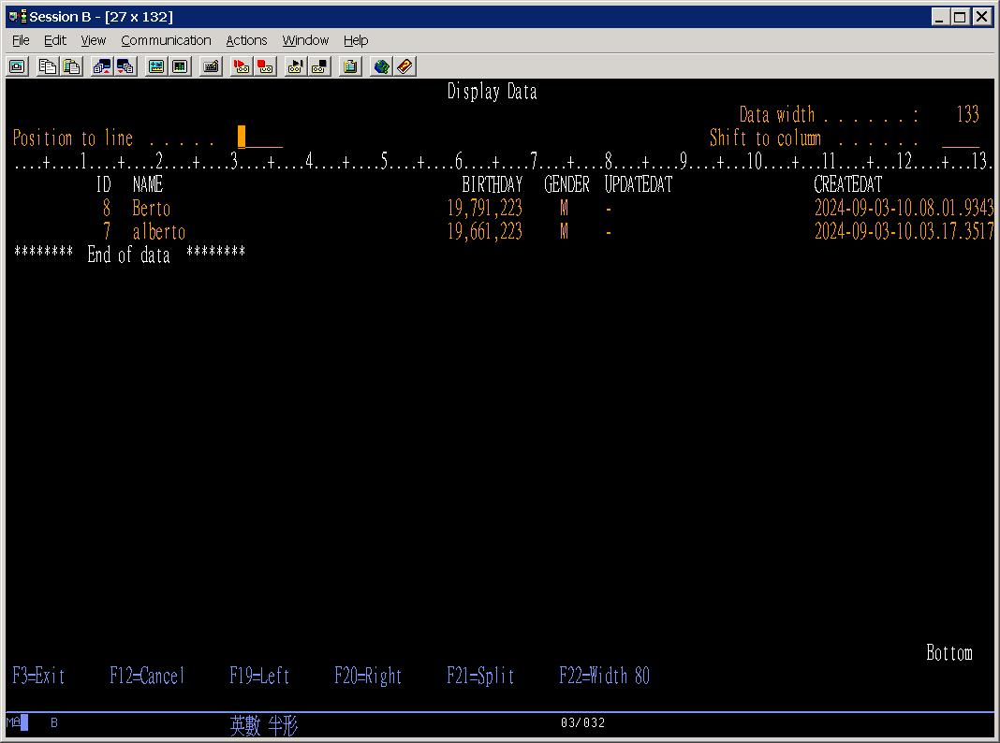

### Reflux 


#### Prologue 
```
Flux and Reflux

Ｏracle				    AS/400

                egg 
FILEA  ←—------------------- FILEA ←–.
                                     |
FILEAB1 —--.                 FILEB1  |
  ↓        |                         |
FILEAB2     `-----------→ FILEB2-----'
```


#### I. The employee table 
To create employee table in AS/400: 
```
CREATE TABLE albertoi/employee (
    id INT GENERATED ALWAYS AS IDENTITY,
    name VARCHAR(40),
    birthday decimal(8, 0) default 19000101,
    gender CHAR(1) default 'M', 
    updatedAt TIMESTAMP, 
    createdAt TIMESTAMP default current timestamp
)
```

Journal employee table: 
```
STRJRNPF FILE(ALBERTOI/EMPLOYEE) JRN(ALBERTOI/MYJRN) IMAGES(*BOTH) OMTJRNE(*OPNCLO)
```


#### II. Three ways to insert data  
Insert employee via [5250 Terminal](https://en.wikipedia.org/wiki/IBM_5250): 
```
insert into albertoi/employee (name, birthday, gender) values('alberto', 19661223, 'M')
insert into albertoi/employee (name, birthday, gender) values('容志強', 19661223, 'M')
```

Insert employee via [DBVisualizer](https://www.dbvis.com/): 
```
insert into albertoi.employee (name, birthday, gender) values('berto', 19791223, 'M')
insert into albertoi.employee (name, birthday, gender) values('小志強', 19791223, 'M')
```

Insert employee via [SQL Developer](https://www.oracle.com/database/sqldeveloper/): 
```
insert into albertoi.employee@as400.ih (name, birthday, gender) values('bertinho', 19991223, 'M')
insert into albertoi.employee@as400.ih (name, birthday, gender) values('小小強', 19991223, 'M')
```

To check back: 
```
select * from albertoi.employee@as400.ih; 
```

As you can see, bad chinese characters! 


#### III. The reflux table
To create reflux table in AS/400: 
```
CREATE TABLE albertoi/reflux (
    id INT GENERATED ALWAYS AS IDENTITY,
    content VARCHAR(1024),
    completed CHAR(6) default 'false',     
    updatedAt TIMESTAMP, 
    createdAt TIMESTAMP default current timestamp
)
```

Journal reflux table: 
```
STRJRNPF FILE(ALBERTOI/REFLUX) JRN(ALBERTOI/MYJRN) IMAGES(*BOTH) OMTJRNE(*OPNCLO)
```


#### IV. The trigger function 
To create triggr function in AS/400:
```
CREATE TRIGGER albertoi/reflux_processor
AFTER INSERT ON reflux
REFERENCING NEW AS new_row
FOR EACH ROW
BEGIN
    DECLARE SQL_STATEMENT_STATUS INT;
    BEGIN
        DECLARE CONTINUE HANDLER FOR SQLEXCEPTION
                SET SQL_STATEMENT_STATUS = -1;
        EXECUTE IMMEDIATE new_row.content; 

        IF SQL_STATEMENT_STATUS = -1 THEN
            UPDATE reflux set updatedAt = current timestamp, completed = 'failed' 
            WHERE id = new_row.id;
        ELSE
            UPDATE reflux set updatedAt = current timestamp, completed = 'true' 
            WHERE id = new_row.id;
        END IF;
    END;
END
```


#### V. Three ways to insert data *indirectly*
Insert reflux table via [5250 Terminal](https://en.wikipedia.org/wiki/IBM_5250): 
```
insert into albertoi/reflux (content) values('insert into albertoi.employee(name, birthday, gender) values(''alberto'', 19661223, ''M'') ')
```

Insert reflux table via [DBVisualizer](https://www.dbvis.com/): 
```
insert into albertoi.reflux (content) values('insert into albertoi.employee(name, birthday, gender) values(''Berto'', 19791223, ''M'') ')
```

Insert reflux table via [SQL Developer](https://www.oracle.com/database/sqldeveloper/): 
```
insert into albertoi.reflux@as400.ih (content) values('insert into albertoi.employee(name, birthday, gender) values(''Bertinho'', 19991223, ''M'') ')

insert into albertoi.reflux@as400.ih (content) values('update albertoi.employee set name=''Perdinho'' where id=9 ')
```


#### VI. On error
```
insert into albertoi.reflux@as400.ih (content) values('update albertoi.employee set birthday='''' where id=9 ')

insert into albertoi.reflux@as400.ih (content) values('update albertoi.employee set birdat=20240903 where id=9 ')
```


#### VII. The results 
```
insert into albertoi.reflux@as400.ih (content) values('delete from albertoi.employee where id=9 ')
```

The reflux table: 
```
select *              
from albertoi/reflux  
order by id desc      
```





The employee table:
```
select *                
from albertoi/employee  
order by id desc        
```



#### Epilogue 
The very idea of `reflux` orginates from the piece of note first proposed on 2023/04/03: 
```
Flux and Reflux on April Fools' Day --- 
implementation of a special form of "Read/Write Splitting" (讀寫分離)

1. The issue 
2. uni-direction data flow : easy to debug 
3. buffer as well as logger 
4. heavily depends on trigger 

Reference
A Descent into the Maelström
https://poemuseum.org/a-descent-into-the-maelstrom/
```


### EOF (2024/09/06)
